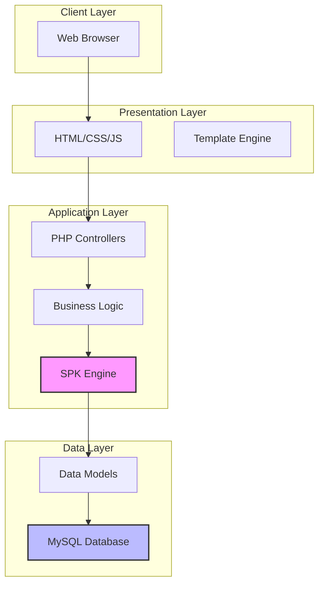

# Project Overview: Sistem Rekomendasi Kost

## 1. Deskripsi Proyek

Sistem Rekomendasi Kost adalah aplikasi web yang dirancang untuk membantu pengguna menemukan kost (tempat tinggal sementara) yang paling sesuai dengan preferensi mereka menggunakan metode **AHP (Analytical Hierarchy Process)** dan **TOPSIS (Technique for Order of Preference by Similarity to Ideal Solution)**.

### 1.1 Tujuan Proyek

- Memberikan rekomendasi kost yang objektif dan terukur berdasarkan multiple criteria
- Memudahkan pencarian kost dengan sistem perankingan otomatis
- Menyediakan interface yang user-friendly dan modern
- Mendukung deployment di platform cloud (Vercel)

### 1.2 Target Pengguna

- Mahasiswa yang mencari tempat kost
- Pekerja yang membutuhkan tempat tinggal sementara
- Orang tua yang mencari kost untuk anak mereka

## 2. Fitur Utama

### 2.1 Fitur Pengguna
- **Pencarian Kost**: Browse daftar kost yang tersedia
- **Filter & Sorting**: Filter berdasarkan kriteria tertentu
- **Sistem Rekomendasi**: Mendapatkan rekomendasi kost terbaik menggunakan AHP-TOPSIS
- **Detail Kost**: Melihat informasi lengkap setiap kost
- **Perbandingan**: Membandingkan beberapa kost sekaligus

### 2.2 Fitur Admin
- **Manajemen Data Kost**: CRUD (Create, Read, Update, Delete) data kost
- **Konfigurasi Bobot Kriteria**: Mengatur bobot untuk setiap kriteria menggunakan AHP
- **Dashboard Analytics**: Melihat statistik dan laporan
- **Manajemen Pengguna**: Kelola akun pengguna

## 3. Kriteria Penilaian

Sistem menggunakan 6 kriteria utama untuk menilai kost:

| No | Kriteria | Tipe | Bobot Default | Keterangan |
|----|----------|------|---------------|------------|
| 1 | Jarak ke Kampus | Cost | 10% | Semakin dekat semakin baik (km) |
| 2 | Jarak ke Market | Cost | 5% | Semakin dekat semakin baik (km) |
| 3 | Harga | Cost | 40% | Semakin murah semakin baik (Rp) |
| 4 | Kebersihan | Benefit | 10% | Skala 1-5 |
| 5 | Keamanan | Benefit | 15% | Skala 1-5 |
| 6 | Fasilitas | Benefit | 20% | Skala 1-5 |

> **Note**: Bobot dapat disesuaikan oleh admin melalui proses AHP

## 4. Metode SPK (Sistem Pendukung Keputusan)

### 4.1 AHP (Analytical Hierarchy Process)
Digunakan untuk menentukan bobot kriteria berdasarkan perbandingan berpasangan (pairwise comparison).

**Proses:**
1. Membuat matriks perbandingan berpasangan
2. Normalisasi matriks
3. Menghitung rata-rata baris untuk mendapatkan bobot
4. Uji konsistensi (Consistency Ratio)

### 4.2 TOPSIS (Technique for Order of Preference by Similarity to Ideal Solution)
Digunakan untuk meranking alternatif (kost) berdasarkan kedekatan dengan solusi ideal.

**Proses:**
1. Normalisasi matriks keputusan
2. Pembobotan matriks ternormalisasi
3. Menentukan solusi ideal positif (A+) dan negatif (A-)
4. Menghitung jarak ke solusi ideal (D+ dan D-)
5. Menghitung nilai preferensi (V = D- / (D+ + D-))
6. Ranking berdasarkan nilai V tertinggi

## 5. Teknologi Stack

### 5.1 Frontend
- **HTML5**: Struktur halaman
- **CSS3**: Styling dengan modern design
- **JavaScript (Vanilla)**: Interaktivitas dan AJAX
- **Bootstrap 5** (optional): Responsive framework

### 5.2 Backend
- **PHP 8.0+**: Server-side logic
- **MySQL/MariaDB**: Database relational
- **Vercel Serverless Functions**: Untuk deployment di Vercel

### 5.3 Development Tools
- **XAMPP**: Local development environment
- **Git**: Version control
- **Composer**: PHP dependency management

## 6. Arsitektur Sistem

## 7. Database Schema Overview

### 7.1 Tabel Utama
- **kost**: Data master kost
- **users**: Data pengguna (admin & user)
- **temp_bobot**: Matriks perbandingan AHP
- **temp_normalisasi_kriteria**: Hasil normalisasi AHP

### 7.2 Tabel Perhitungan TOPSIS
- **temp_normalisasi**: Matriks ternormalisasi
- **temp_d_pos**: Jarak ke solusi ideal positif
- **temp_d_neg**: Jarak ke solusi ideal negatif
- **temp_nilai_pref**: Nilai preferensi akhir

## 8. Deployment Strategy

### 8.1 Development (Local)
- XAMPP dengan Apache & MySQL
- URL: `http://localhost/SPK_Rekomendasi_Kost`

### 8.2 Production (Vercel)
- Frontend: Static files di Vercel
- Backend: Vercel Serverless Functions (PHP → Node.js adapter atau API Routes)
- Database: Neon PostgreSQL / PlanetScale MySQL / Supabase

> **Important**: PHP tidak native support di Vercel, perlu konversi ke Node.js API atau menggunakan Vercel PHP Runtime

## 9. Design Reference

Proyek ini menggunakan template modern dengan karakteristik:
- **Clean & Minimalist**: Layout yang bersih dan mudah dipahami
- **Gradient & Glassmorphism**: Efek visual modern
- **Responsive Design**: Mobile-first approach
- **Interactive Elements**: Hover effects dan smooth animations
- **Color Scheme**: Purple/Blue gradient dengan white background

## 10. Timeline Estimasi

| Fase | Durasi | Deliverables |
|------|--------|--------------|
| Planning & Design | 1 minggu | Dokumentasi, wireframe, database design |
| Frontend Development | 2 minggu | UI/UX implementation |
| Backend Development | 2 minggu | SPK logic, API, CRUD |
| Integration & Testing | 1 minggu | Integration testing, bug fixes |
| Deployment Setup | 1 minggu | Vercel configuration, database migration |
| **Total** | **7 minggu** | Production-ready application |

## 11. Success Metrics

- **Performance**: Page load < 3 detik
- **Accuracy**: Hasil rekomendasi konsisten dengan bobot yang ditetapkan
- **Usability**: User dapat menemukan kost dalam < 5 klik
- **Availability**: Uptime > 99%
- **Responsiveness**: Support mobile, tablet, desktop

## 12. Risks & Mitigation

| Risk | Impact | Mitigation |
|------|--------|------------|
| PHP tidak support di Vercel | High | Gunakan Vercel PHP Runtime atau konversi ke Node.js |
| Database migration complexity | Medium | Gunakan managed database (Neon/PlanetScale) |
| SPK calculation performance | Medium | Implement caching untuk hasil perhitungan |
| User adoption | Low | Provide tutorial dan dokumentasi lengkap |

---

**Document Version**: 1.0  
**Last Updated**: 2026-01-04  
**Author**: Development Team
