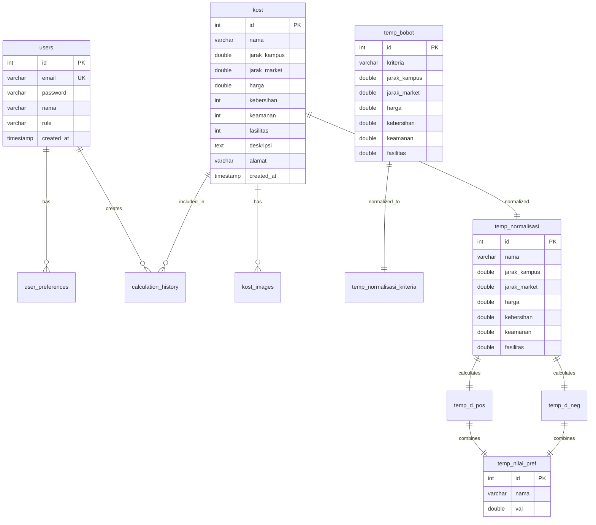

# Database Specification
## Sistem Rekomendasi Kost

---

## 1. Database Overview

### 1.1 Database Information
- **Database Name**: `spk_kost`
- **DBMS**: MySQL 8.0+ / MariaDB 10.4+
- **Character Set**: utf8mb4
- **Collation**: utf8mb4_general_ci
- **Engine**: InnoDB (for transactions & foreign keys)

### 1.2 Design Principles
- **Normalization**: 3NF (Third Normal Form)
- **Indexing**: Primary keys, foreign keys, frequently queried columns
- **Naming Convention**: snake_case untuk table & column names
- **Data Integrity**: Foreign key constraints, NOT NULL constraints

---

## 2. Entity Relationship Diagram (ERD)



---

## 3. Table Specifications

### 3.1 Master Tables

#### 3.1.1 Table: `users`

**Purpose**: Menyimpan data pengguna (admin & user)

| Column | Type | Constraints | Description |
|--------|------|-------------|-------------|
| id | INT(11) | PRIMARY KEY, AUTO_INCREMENT | User ID |
| email | VARCHAR(191) | NOT NULL, UNIQUE | Email address |
| password | VARCHAR(255) | NOT NULL | Hashed password (bcrypt) |
| nama | VARCHAR(191) | NOT NULL | Full name |
| telepon | VARCHAR(20) | NULL | Phone number |
| role | ENUM('admin','user') | NOT NULL, DEFAULT 'user' | User role |
| foto_profil | VARCHAR(255) | NULL | Profile picture URL |
| is_active | TINYINT(1) | NOT NULL, DEFAULT 1 | Account status |
| created_at | TIMESTAMP | DEFAULT CURRENT_TIMESTAMP | Registration date |
| updated_at | TIMESTAMP | DEFAULT CURRENT_TIMESTAMP ON UPDATE CURRENT_TIMESTAMP | Last update |

**Indexes**:
- PRIMARY KEY (`id`)
- UNIQUE KEY `email_unique` (`email`)
- INDEX `role_idx` (`role`)

**SQL**:
```sql
CREATE TABLE `users` (
  `id` INT(11) NOT NULL AUTO_INCREMENT,
  `email` VARCHAR(191) NOT NULL,
  `password` VARCHAR(255) NOT NULL,
  `nama` VARCHAR(191) NOT NULL,
  `telepon` VARCHAR(20) DEFAULT NULL,
  `role` ENUM('admin','user') NOT NULL DEFAULT 'user',
  `foto_profil` VARCHAR(255) DEFAULT NULL,
  `is_active` TINYINT(1) NOT NULL DEFAULT 1,
  `created_at` TIMESTAMP DEFAULT CURRENT_TIMESTAMP,
  `updated_at` TIMESTAMP DEFAULT CURRENT_TIMESTAMP ON UPDATE CURRENT_TIMESTAMP,
  PRIMARY KEY (`id`),
  UNIQUE KEY `email_unique` (`email`),
  INDEX `role_idx` (`role`)
) ENGINE=InnoDB DEFAULT CHARSET=utf8mb4 COLLATE=utf8mb4_general_ci;
```

---

#### 3.1.2 Table: `kost`

**Purpose**: Menyimpan data master kost

| Column | Type | Constraints | Description |
|--------|------|-------------|-------------|
| id | INT(11) | PRIMARY KEY, AUTO_INCREMENT | Kost ID |
| nama | VARCHAR(191) | NOT NULL | Nama kost |
| jarak_kampus | DOUBLE | NOT NULL | Jarak ke kampus (km) |
| jarak_market | DOUBLE | NOT NULL | Jarak ke market (km) |
| harga | DOUBLE | NOT NULL | Harga per bulan (Rp) |
| kebersihan | INT(3) | NOT NULL | Rating kebersihan (1-5) |
| keamanan | INT(3) | NOT NULL | Rating keamanan (1-5) |
| fasilitas | INT(3) | NOT NULL | Rating fasilitas (1-5) |
| deskripsi | TEXT | NULL | Deskripsi lengkap |
| alamat | VARCHAR(255) | NULL | Alamat lengkap |
| latitude | DECIMAL(10,8) | NULL | Koordinat latitude |
| longitude | DECIMAL(11,8) | NULL | Koordinat longitude |
| foto_utama | VARCHAR(255) | NULL | URL foto utama |
| is_active | TINYINT(1) | NOT NULL, DEFAULT 1 | Status aktif |
| created_at | TIMESTAMP | DEFAULT CURRENT_TIMESTAMP | Tanggal dibuat |
| updated_at | TIMESTAMP | DEFAULT CURRENT_TIMESTAMP ON UPDATE CURRENT_TIMESTAMP | Last update |

**Indexes**:
- PRIMARY KEY (`id`)
- INDEX `harga_idx` (`harga`)
- INDEX `jarak_kampus_idx` (`jarak_kampus`)
- INDEX `is_active_idx` (`is_active`)

**Constraints**:
- CHECK (`kebersihan` BETWEEN 1 AND 5)
- CHECK (`keamanan` BETWEEN 1 AND 5)
- CHECK (`fasilitas` BETWEEN 1 AND 5)
- CHECK (`jarak_kampus` >= 0)
- CHECK (`jarak_market` >= 0)
- CHECK (`harga` > 0)

**SQL**:
```sql
CREATE TABLE `kost` (
  `id` INT(11) NOT NULL AUTO_INCREMENT,
  `nama` VARCHAR(191) NOT NULL,
  `jarak_kampus` DOUBLE NOT NULL,
  `jarak_market` DOUBLE NOT NULL,
  `harga` DOUBLE NOT NULL,
  `kebersihan` INT(3) NOT NULL,
  `keamanan` INT(3) NOT NULL,
  `fasilitas` INT(3) NOT NULL,
  `deskripsi` TEXT DEFAULT NULL,
  `alamat` VARCHAR(255) DEFAULT NULL,
  `latitude` DECIMAL(10,8) DEFAULT NULL,
  `longitude` DECIMAL(11,8) DEFAULT NULL,
  `foto_utama` VARCHAR(255) DEFAULT NULL,
  `is_active` TINYINT(1) NOT NULL DEFAULT 1,
  `created_at` TIMESTAMP DEFAULT CURRENT_TIMESTAMP,
  `updated_at` TIMESTAMP DEFAULT CURRENT_TIMESTAMP ON UPDATE CURRENT_TIMESTAMP,
  PRIMARY KEY (`id`),
  INDEX `harga_idx` (`harga`),
  INDEX `jarak_kampus_idx` (`jarak_kampus`),
  INDEX `is_active_idx` (`is_active`),
  CONSTRAINT `chk_kebersihan` CHECK (`kebersihan` BETWEEN 1 AND 5),
  CONSTRAINT `chk_keamanan` CHECK (`keamanan` BETWEEN 1 AND 5),
  CONSTRAINT `chk_fasilitas` CHECK (`fasilitas` BETWEEN 1 AND 5),
  CONSTRAINT `chk_jarak_kampus` CHECK (`jarak_kampus` >= 0),
  CONSTRAINT `chk_jarak_market` CHECK (`jarak_market` >= 0),
  CONSTRAINT `chk_harga` CHECK (`harga` > 0)
) ENGINE=InnoDB DEFAULT CHARSET=utf8mb4 COLLATE=utf8mb4_general_ci;
```

---

#### 3.1.3 Table: `kost_images`

**Purpose**: Menyimpan multiple images untuk setiap kost

| Column | Type | Constraints | Description |
|--------|------|-------------|-------------|
| id | INT(11) | PRIMARY KEY, AUTO_INCREMENT | Image ID |
| kost_id | INT(11) | NOT NULL, FOREIGN KEY | Reference to kost |
| image_url | VARCHAR(255) | NOT NULL | Image URL |
| caption | VARCHAR(191) | NULL | Image caption |
| urutan | INT(3) | NOT NULL, DEFAULT 0 | Display order |
| created_at | TIMESTAMP | DEFAULT CURRENT_TIMESTAMP | Upload date |

**Indexes**:
- PRIMARY KEY (`id`)
- FOREIGN KEY `fk_kost_images_kost` (`kost_id`) REFERENCES `kost`(`id`) ON DELETE CASCADE
- INDEX `kost_id_idx` (`kost_id`)

**SQL**:
```sql
CREATE TABLE `kost_images` (
  `id` INT(11) NOT NULL AUTO_INCREMENT,
  `kost_id` INT(11) NOT NULL,
  `image_url` VARCHAR(255) NOT NULL,
  `caption` VARCHAR(191) DEFAULT NULL,
  `urutan` INT(3) NOT NULL DEFAULT 0,
  `created_at` TIMESTAMP DEFAULT CURRENT_TIMESTAMP,
  PRIMARY KEY (`id`),
  INDEX `kost_id_idx` (`kost_id`),
  CONSTRAINT `fk_kost_images_kost` FOREIGN KEY (`kost_id`) REFERENCES `kost`(`id`) ON DELETE CASCADE
) ENGINE=InnoDB DEFAULT CHARSET=utf8mb4 COLLATE=utf8mb4_general_ci;
```

---

### 3.2 AHP Tables

#### 3.2.1 Table: `temp_bobot`

**Purpose**: Menyimpan matriks perbandingan berpasangan AHP

| Column | Type | Constraints | Description |
|--------|------|-------------|-------------|
| id | INT(11) | PRIMARY KEY, AUTO_INCREMENT | Row ID |
| kriteria | VARCHAR(191) | NOT NULL | Nama kriteria (row) |
| jarak_kampus | DOUBLE | NOT NULL | Comparison value |
| jarak_market | DOUBLE | NOT NULL | Comparison value |
| harga | DOUBLE | NOT NULL | Comparison value |
| kebersihan | DOUBLE | NOT NULL | Comparison value |
| keamanan | DOUBLE | NOT NULL | Comparison value |
| fasilitas | DOUBLE | NOT NULL | Comparison value |

**Note**: Tabel ini menyimpan matriks 6x6 perbandingan berpasangan

**SQL**:
```sql
CREATE TABLE `temp_bobot` (
  `id` INT(11) NOT NULL AUTO_INCREMENT,
  `kriteria` VARCHAR(191) NOT NULL,
  `jarak_kampus` DOUBLE NOT NULL,
  `jarak_market` DOUBLE NOT NULL,
  `harga` DOUBLE NOT NULL,
  `kebersihan` DOUBLE NOT NULL,
  `keamanan` DOUBLE NOT NULL,
  `fasilitas` DOUBLE NOT NULL,
  PRIMARY KEY (`id`)
) ENGINE=InnoDB DEFAULT CHARSET=utf8mb4 COLLATE=utf8mb4_general_ci;
```

---

#### 3.2.2 Table: `temp_normalisasi_kriteria`

**Purpose**: Menyimpan hasil normalisasi matriks AHP dan bobot akhir

| Column | Type | Constraints | Description |
|--------|------|-------------|-------------|
| id | INT(11) | PRIMARY KEY, AUTO_INCREMENT | Row ID |
| kriteria | VARCHAR(191) | NOT NULL | Nama kriteria |
| jarak_kampus | DOUBLE | NOT NULL | Normalized value |
| jarak_market | DOUBLE | NOT NULL | Normalized value |
| harga | DOUBLE | NOT NULL | Normalized value |
| kebersihan | DOUBLE | NOT NULL | Normalized value |
| keamanan | DOUBLE | NOT NULL | Normalized value |
| fasilitas | DOUBLE | NOT NULL | Normalized value |
| avg | DOUBLE | NULL | Average (bobot kriteria) |
| matrix_aw | DOUBLE | NULL | Matrix * Weight |

**SQL**:
```sql
CREATE TABLE `temp_normalisasi_kriteria` (
  `id` INT(11) NOT NULL AUTO_INCREMENT,
  `kriteria` VARCHAR(191) NOT NULL,
  `jarak_kampus` DOUBLE NOT NULL,
  `jarak_market` DOUBLE NOT NULL,
  `harga` DOUBLE NOT NULL,
  `kebersihan` DOUBLE NOT NULL,
  `keamanan` DOUBLE NOT NULL,
  `fasilitas` DOUBLE NOT NULL,
  `avg` DOUBLE DEFAULT NULL,
  `matrix_aw` DOUBLE DEFAULT NULL,
  PRIMARY KEY (`id`)
) ENGINE=InnoDB DEFAULT CHARSET=utf8mb4 COLLATE=utf8mb4_general_ci;
```

---

### 3.3 TOPSIS Tables

#### 3.3.1 Table: `temp_normalisasi`

**Purpose**: Menyimpan matriks ternormalisasi TOPSIS

| Column | Type | Constraints | Description |
|--------|------|-------------|-------------|
| id | INT(11) | PRIMARY KEY, AUTO_INCREMENT | Row ID |
| nama | VARCHAR(191) | NOT NULL | Nama kost |
| jarak_kampus | DOUBLE | NOT NULL | Normalized value |
| jarak_market | DOUBLE | NOT NULL | Normalized value |
| harga | DOUBLE | NOT NULL | Normalized value |
| kebersihan | DOUBLE | NOT NULL | Normalized value |
| keamanan | DOUBLE | NOT NULL | Normalized value |
| fasilitas | DOUBLE | NOT NULL | Normalized value |

**Formula**: 
```
r_ij = x_ij / sqrt(sum(x_ij^2))
```

**SQL**:
```sql
CREATE TABLE `temp_normalisasi` (
  `id` INT(11) NOT NULL AUTO_INCREMENT,
  `nama` VARCHAR(191) NOT NULL,
  `jarak_kampus` DOUBLE NOT NULL,
  `jarak_market` DOUBLE NOT NULL,
  `harga` DOUBLE NOT NULL,
  `kebersihan` DOUBLE NOT NULL,
  `keamanan` DOUBLE NOT NULL,
  `fasilitas` DOUBLE NOT NULL,
  PRIMARY KEY (`id`)
) ENGINE=InnoDB DEFAULT CHARSET=utf8mb4 COLLATE=utf8mb4_general_ci;
```

---

#### 3.3.2 Table: `temp_d_pos`

**Purpose**: Menyimpan jarak ke solusi ideal positif (D+)

| Column | Type | Constraints | Description |
|--------|------|-------------|-------------|
| id | INT(11) | PRIMARY KEY, AUTO_INCREMENT | Row ID |
| nama | VARCHAR(191) | NOT NULL | Nama kost |
| dPositif | DOUBLE | NOT NULL | D+ value |

**Formula**:
```
D+ = sqrt(sum((y_ij - A+_j)^2))
```

**SQL**:
```sql
CREATE TABLE `temp_d_pos` (
  `id` INT(11) NOT NULL AUTO_INCREMENT,
  `nama` VARCHAR(191) NOT NULL,
  `dPositif` DOUBLE NOT NULL,
  PRIMARY KEY (`id`)
) ENGINE=InnoDB DEFAULT CHARSET=utf8mb4 COLLATE=utf8mb4_general_ci;
```

---

#### 3.3.3 Table: `temp_d_neg`

**Purpose**: Menyimpan jarak ke solusi ideal negatif (D-)

| Column | Type | Constraints | Description |
|--------|------|-------------|-------------|
| id | INT(11) | PRIMARY KEY, AUTO_INCREMENT | Row ID |
| nama | VARCHAR(191) | NOT NULL | Nama kost |
| dNegatif | DOUBLE | NOT NULL | D- value |

**Formula**:
```
D- = sqrt(sum((y_ij - A-_j)^2))
```

**SQL**:
```sql
CREATE TABLE `temp_d_neg` (
  `id` INT(11) NOT NULL AUTO_INCREMENT,
  `nama` VARCHAR(191) NOT NULL,
  `dNegatif` DOUBLE NOT NULL,
  PRIMARY KEY (`id`)
) ENGINE=InnoDB DEFAULT CHARSET=utf8mb4 COLLATE=utf8mb4_general_ci;
```

---

#### 3.3.4 Table: `temp_nilai_pref`

**Purpose**: Menyimpan nilai preferensi akhir (V)

| Column | Type | Constraints | Description |
|--------|------|-------------|-------------|
| id | INT(11) | PRIMARY KEY, AUTO_INCREMENT | Row ID |
| nama | VARCHAR(191) | NOT NULL | Nama kost |
| val | DOUBLE | NOT NULL | Preference value (0-1) |

**Formula**:
```
V = D- / (D+ + D-)
```

**Ranking**: ORDER BY `val` DESC

**SQL**:
```sql
CREATE TABLE `temp_nilai_pref` (
  `id` INT(11) NOT NULL AUTO_INCREMENT,
  `nama` VARCHAR(191) NOT NULL,
  `val` DOUBLE NOT NULL,
  PRIMARY KEY (`id`)
) ENGINE=InnoDB DEFAULT CHARSET=utf8mb4 COLLATE=utf8mb4_general_ci;
```

---

### 3.4 Additional Tables

#### 3.4.1 Table: `user_preferences`

**Purpose**: Menyimpan preferensi user untuk personalized recommendations

| Column | Type | Constraints | Description |
|--------|------|-------------|-------------|
| id | INT(11) | PRIMARY KEY, AUTO_INCREMENT | Preference ID |
| user_id | INT(11) | NOT NULL, FOREIGN KEY | Reference to users |
| max_harga | DOUBLE | NULL | Maximum budget |
| max_jarak_kampus | DOUBLE | NULL | Max distance to campus |
| min_kebersihan | INT(3) | NULL | Min cleanliness rating |
| min_keamanan | INT(3) | NULL | Min security rating |
| min_fasilitas | INT(3) | NULL | Min facility rating |
| created_at | TIMESTAMP | DEFAULT CURRENT_TIMESTAMP | Created date |
| updated_at | TIMESTAMP | DEFAULT CURRENT_TIMESTAMP ON UPDATE CURRENT_TIMESTAMP | Last update |

**SQL**:
```sql
CREATE TABLE `user_preferences` (
  `id` INT(11) NOT NULL AUTO_INCREMENT,
  `user_id` INT(11) NOT NULL,
  `max_harga` DOUBLE DEFAULT NULL,
  `max_jarak_kampus` DOUBLE DEFAULT NULL,
  `min_kebersihan` INT(3) DEFAULT NULL,
  `min_keamanan` INT(3) DEFAULT NULL,
  `min_fasilitas` INT(3) DEFAULT NULL,
  `created_at` TIMESTAMP DEFAULT CURRENT_TIMESTAMP,
  `updated_at` TIMESTAMP DEFAULT CURRENT_TIMESTAMP ON UPDATE CURRENT_TIMESTAMP,
  PRIMARY KEY (`id`),
  CONSTRAINT `fk_user_pref_user` FOREIGN KEY (`user_id`) REFERENCES `users`(`id`) ON DELETE CASCADE
) ENGINE=InnoDB DEFAULT CHARSET=utf8mb4 COLLATE=utf8mb4_general_ci;
```

---

#### 3.4.2 Table: `calculation_history`

**Purpose**: Menyimpan history perhitungan untuk audit trail

| Column | Type | Constraints | Description |
|--------|------|-------------|-------------|
| id | INT(11) | PRIMARY KEY, AUTO_INCREMENT | History ID |
| user_id | INT(11) | NULL, FOREIGN KEY | User who triggered |
| calculation_type | ENUM('ahp','topsis') | NOT NULL | Type of calculation |
| input_data | JSON | NULL | Input parameters |
| result_data | JSON | NULL | Calculation results |
| execution_time | DOUBLE | NULL | Execution time (seconds) |
| created_at | TIMESTAMP | DEFAULT CURRENT_TIMESTAMP | Calculation date |

**SQL**:
```sql
CREATE TABLE `calculation_history` (
  `id` INT(11) NOT NULL AUTO_INCREMENT,
  `user_id` INT(11) DEFAULT NULL,
  `calculation_type` ENUM('ahp','topsis') NOT NULL,
  `input_data` JSON DEFAULT NULL,
  `result_data` JSON DEFAULT NULL,
  `execution_time` DOUBLE DEFAULT NULL,
  `created_at` TIMESTAMP DEFAULT CURRENT_TIMESTAMP,
  PRIMARY KEY (`id`),
  INDEX `user_id_idx` (`user_id`),
  INDEX `created_at_idx` (`created_at`),
  CONSTRAINT `fk_calc_history_user` FOREIGN KEY (`user_id`) REFERENCES `users`(`id`) ON DELETE SET NULL
) ENGINE=InnoDB DEFAULT CHARSET=utf8mb4 COLLATE=utf8mb4_general_ci;
```

---

## 4. Sample Data

### 4.1 Default Admin User

```sql
INSERT INTO `users` (`email`, `password`, `nama`, `role`) VALUES
('admin@spkkost.com', '$2y$10$92IXUNpkjO0rOQ5byMi.Ye4oKoEa3Ro9llC/.og/at2.uheWG/igi', 'Administrator', 'admin');
-- Password: password
```

### 4.2 Sample Kost Data

```sql
INSERT INTO `kost` (`nama`, `jarak_kampus`, `jarak_market`, `harga`, `kebersihan`, `keamanan`, `fasilitas`) VALUES
('Kost Papipul Pakuwon Mezanine', 1.2, 0.5, 2500000, 5, 4, 5),
('Kost Eleora Cikunir Tipe C', 2.5, 1, 1299000, 4, 5, 5),
('Kost De Jatti', 3.1, 0.8, 1400000, 4, 4, 5);
```

### 4.3 Default AHP Weights

```sql
INSERT INTO `temp_bobot` (`kriteria`, `jarak_kampus`, `jarak_market`, `harga`, `kebersihan`, `keamanan`, `fasilitas`) VALUES
('Jarak Kampus', 1, 2, 0.25, 1, 0.6667, 0.5),
('Jarak Market', 0.5, 1, 0.125, 0.5, 0.3333, 0.25),
('Harga', 4, 8, 1, 4, 2.6667, 2),
('Kebersihan', 1, 2, 0.25, 1, 0.6667, 0.5),
('Keamanan', 1.5, 3, 0.375, 1.5, 1, 0.75),
('Fasilitas', 2, 4, 0.5, 2, 1.3333, 1);
```

---

## 5. Database Maintenance

### 5.1 Backup Strategy
- **Frequency**: Daily automated backup
- **Retention**: 30 days
- **Method**: mysqldump atau managed database backup

### 5.2 Cleanup Procedures

```sql
-- Clear TOPSIS calculation tables
TRUNCATE TABLE temp_normalisasi;
TRUNCATE TABLE temp_d_pos;
TRUNCATE TABLE temp_d_neg;
TRUNCATE TABLE temp_nilai_pref;

-- Delete old calculation history (older than 90 days)
DELETE FROM calculation_history WHERE created_at < DATE_SUB(NOW(), INTERVAL 90 DAY);
```

### 5.3 Performance Optimization

```sql
-- Analyze tables
ANALYZE TABLE kost, users, temp_normalisasi;

-- Optimize tables
OPTIMIZE TABLE kost, users;
```

---

## 6. Migration to Cloud Database

### 6.1 Neon PostgreSQL
- Convert MySQL syntax to PostgreSQL
- Replace AUTO_INCREMENT dengan SERIAL
- Replace DOUBLE dengan NUMERIC atau DOUBLE PRECISION

### 6.2 PlanetScale MySQL
- Compatible dengan MySQL syntax
- Gunakan Vitess-compatible schema
- No foreign key constraints (handle di application layer)

### 6.3 Supabase
- PostgreSQL-based
- Similar to Neon migration
- Built-in auth dapat replace users table

---

**Document Version**: 1.0  
**Last Updated**: 2026-01-04  
**Database Schema Version**: 1.0
